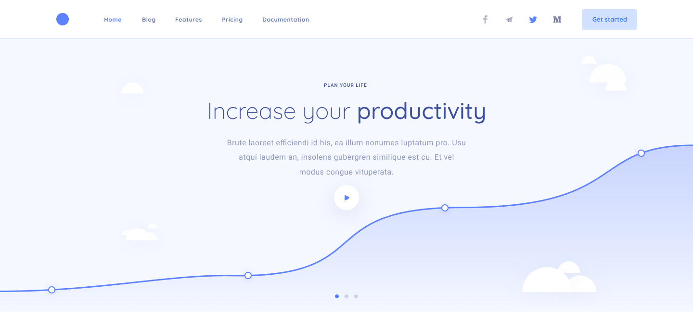

## Productivity

### Links

### How to Install

1. Open **01-productivity** folder
2. Install all dependencies ``npm install``
3. Start project  ``npm run start`` or build project ``npm run build``

### Languages

### Tools

